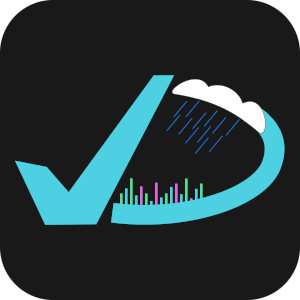
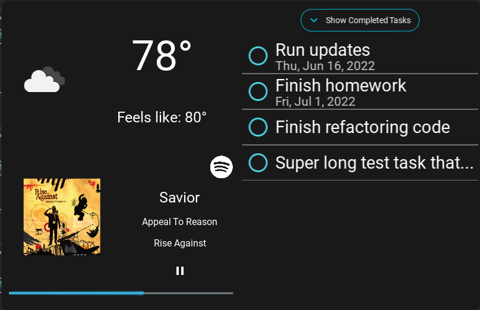

<!--
*** This readme is inspired by the Best-README-Template available at https://github.com/othneildrew/Best-README-Template. Thanks to othneildrew for the inspiration!
-->

<!-- PROJECT SHIELDS -->
<!--
*** I'm using markdown "reference style" links for readability.
*** Reference links are enclosed in brackets [ ] instead of parentheses ( ).
*** See the bottom of this document for the declaration of the reference variables
*** for contributors-url, forks-url, etc. This is an optional, concise syntax you may use.
*** https://www.markdownguide.org/basic-syntax/#reference-style-links
-->
[![Contributors][contributors-shield]][contributors-url]
[![Stargazers][stars-shield]][stars-url]
[![Issues][issues-shield]][issues-url]
[![MIT License][license-shield]][license-url]
<!-- [![Forks][forks-shield]][forks-url] -->

<!-- PROJECT LOGO -->
 

  

  <h1 align="center">Deskity</h3>

  

    A small app that uses Python and Kivy. Syncs with Microsoft ToDo as well as Gmail and OpenWeatherMap for information. Designed to run on a 3.5" touch screen for the raspberry pi.
     
    <a href="https://github.com/bennett-wendorf/Deskity"><strong>Explore the docs »</strong></a>
     
     
    <a href="https://github.com/bennett-wendorf/Deskity/issues">Report Bug</a>
    ·
    <a href="https://github.com/bennett-wendorf/Deskity/issues">Request Feature</a>
  

<!-- TABLE OF CONTENTS -->

  
Table of Contents

  <ol>
    <li>
      <a href="#about-the-project">About The Project</a>
      <ul>
        <li><a href="#built-with">Built With</a></li>
      </ul>
    </li>
    <li>
      <a href="#getting-started">Getting Started</a>
      <ul>
        <li><a href="#installation">Installation</a></li>
      </ul>
    </li>
    <li><a href="#roadmap">Roadmap</a></li>
    <li><a href="#contributing">Contributing</a></li>
    <li><a href="#license">License</a></li>
    <li><a href="#contact">Contact</a></li>
    <li><a href="#acknowledgements">Acknowledgements</a></li>
  </ol>

<!-- ABOUT THE PROJECT -->
## About The Project

When I started this project, I was both looking for a way to use the raspberry pi I had recently obtained, and also a way to expand my skills with python. The use case I came up with for a small desk accessory that showed some useful information at a glance was so specialized that I just decided to build it myself, rather than searching for a solution that did exactly what I wanted.

### Built With

This project is written in python using kivy for the UI elements. 
* [Python](https://www.python.org/)
* [Kivy](https://kivy.org)

<!-- GETTING STARTED -->
## Getting Started

See the instructions on the [wiki](https://github.com/Bennett-Wendorf/Deskity/wiki/Getting-Started) for help with getting this project set up.

<!-- ROADMAP -->
## Roadmap

See the [projects](https://github.com/Bennett-Wendorf/Deskity/projects) tab for an updated list of what I am working on. For any feature requests, please create an [issue](https://github.com/Bennett-Wendorf/Deskity/issues) (See [Contributing](#contributing)).

<!-- CONTRIBUTING -->
## Contributing

Contributions are what make the open source community such an amazing place to be learn, inspire, and create. Any contributions you make are **greatly appreciated**.

1. Fork the Project
2. Create your Feature Branch (`git checkout -b feature/AmazingFeature`)
3. Commit your Changes (`git commit -m 'Add some AmazingFeature'`)
4. Push to the Branch (`git push origin feature/AmazingFeature`)
5. Open a Pull Request

If you find an issue in existing code, feel free to use the above procedure to generate a change, or open an [issue](https://github.com/Bennett-Wendorf/Deskity/issues) for me to fix it.

<!-- LICENSE -->
## License

Distributed under the MIT License. See `LICENSE` for more information.

<!-- CONTACT -->
## Contact

Bennett Wendorf - [Website](https://bennett-wendorf.github.io/) - bennettwendorf@gmail.com

Project Link: [https://github.com/Bennett-Wendorf/Deskity](https://github.com/Bennett-Wendorf/Deskity)

<!-- ACKNOWLEDGEMENTS -->
## Acknowledgements
* [Img Shields](https://shields.io)
* [Microsoft Graph API](https://docs.microsoft.com/en-us/graph/overview)
* [MSAL for Python](https://github.com/AzureAD/microsoft-authentication-library-for-python)
* [OpenWeatherMap API](https://openweathermap.org/api)
<!-- * [GitHub Pages](https://pages.github.com) -->

<!-- MARKDOWN LINKS & IMAGES -->
<!-- https://www.markdownguide.org/basic-syntax/#reference-style-links -->
[contributors-shield]: https://img.shields.io/github/contributors/bennett-wendorf/Deskity.svg?style=flat&color=informational
[contributors-url]: https://github.com/bennett-wendorf/Deskity/graphs/contributors
[forks-shield]: https://img.shields.io/github/forks/bennett-wendorf/Deskity.svg?style=flat
[forks-url]: https://github.com/bennett-wendorf/Deskity/network/members
[stars-shield]: https://img.shields.io/github/stars/bennett-wendorf/Deskity.svg?style=flat&color=yellow
[stars-url]: https://github.com/bennett-wendorf/Deskity/stargazers
[issues-shield]: https://img.shields.io/github/issues/bennett-wendorf/Deskity.svg?style=flat&color=red
[issues-url]: https://github.com/bennett-wendorf/Deskity/issues
[license-shield]: https://img.shields.io/github/license/bennett-wendorf/Deskity.svg?style=flat
[license-url]: https://github.com/bennett-wendorf/Deskity/blob/master/LICENSE
