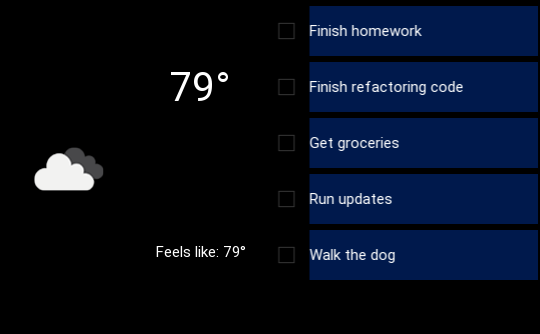

<!--
*** This readme is inspired by the Best-README-Template available at https://github.com/othneildrew/Best-README-Template. Thanks to othneildrew for the inspiration!
-->


<!-- PROJECT SHIELDS -->
<!--
*** I'm using markdown "reference style" links for readability.
*** Reference links are enclosed in brackets [ ] instead of parentheses ( ).
*** See the bottom of this document for the declaration of the reference variables
*** for contributors-url, forks-url, etc. This is an optional, concise syntax you may use.
*** https://www.markdownguide.org/basic-syntax/#reference-style-links
-->
[![Contributors][contributors-shield]][contributors-url]
[![Stargazers][stars-shield]][stars-url]
[![Issues][issues-shield]][issues-url]
[![MIT License][license-shield]][license-url]
<!-- [![Forks][forks-shield]][forks-url] -->


<!-- PROJECT LOGO -->
<br />
<p align="center">
  <!-- TODO Add logo here -->
  <!-- <a href="https://github.com/bennett-wendorf/Kivy-Raspi-Desktop-App">
    
  </a> -->

  <h1 align="center">Kivy Raspi Desktop App</h3>

  <p align="center">
    A small app that uses Python and Kivy. Syncs with Microsoft ToDo as well as Gmail and OpenWeatherMap for information. Designed to run on a 3.5" touch screen for the raspberry pi.
    <br />
    <a href="https://github.com/bennett-wendorf/Kivy-Raspi-Desktop-App"><strong>Explore the docs »</strong></a>
    <br />
    <br />
    <a href="https://github.com/bennett-wendorf/Kivy-Raspi-Desktop-App/issues">Report Bug</a>
    ·
    <a href="https://github.com/bennett-wendorf/Kivy-Raspi-Desktop-App/issues">Request Feature</a>
  </p>
</p>


<!-- TABLE OF CONTENTS -->
<details open="open">
  <summary>Table of Contents</summary>
  <ol>
    <li>
      <a href="#about-the-project">About The Project</a>
      <ul>
        <li><a href="#built-with">Built With</a></li>
      </ul>
    </li>
    <li>
      <a href="#getting-started">Getting Started</a>
      <ul>
        <li><a href="#installation">Installation</a></li>
      </ul>
    </li>
    <li><a href="#roadmap">Roadmap</a></li>
    <li><a href="#contributing">Contributing</a></li>
    <li><a href="#license">License</a></li>
    <li><a href="#contact">Contact</a></li>
    <li><a href="#acknowledgements">Acknowledgements</a></li>
  </ol>
</details>


<!-- ABOUT THE PROJECT -->
## About The Project

<p align='center'></p>

When I started this project, I was both looking for a way to use the raspberry pi I had recently obtained, and also a way to expand my skills with python. The use case I came up with for a small desk accessory that showed some useful information at a glance was so specialized that I just decided to build it myself, rather than searching for a solution that did exactly what I wanted.

### Built With

This project is written in python using kivy for the UI elements. 
* [Python](https://www.python.org/)
* [Kivy](https://kivy.org)


<!-- GETTING STARTED -->
## Getting Started

For now, there is no installer or prepackaged installation for this project. This will be coming in the future. For now, follow the installation instructions below.

### Installation

1. Get a free API Key for weather data at [openweathermap.org/api](https://openweathermap.org/api).
    * Add this key in `integrations/WeatherIntegrations/WeatherWidget.py`
      ```python
      api_key = "<Your Key Here>"
      ```
    * You can also try to use my API key that is already there, but that may lead to throttling issues over time with OpenWeatherMap's free API. It is preferable to get your own key.
2. Clone the repo
   ```sh
   git clone https://github.com/Bennett-Wendorf/Kivy-Raspi-Desktop-App.git
   ```
3. Install dependencies
    * Use pipenv to install the requirements in a virtual environment
      ```sh
      pipenv install
      ```
    OR
    * Manually install requirements using `pip`
      ```sh
      pip install <requirements from Pipfile>
      ```
4. Run the app
    * If pipenv was used:
      ```sh
      pipenv run python main.py
      ```
    OR
    * If not, just run:
      ```sh
      python main.py
      ```


<!-- ROADMAP -->
## Roadmap

See the [projects](https://github.com/Bennett-Wendorf/Kivy-Raspi-Desktop-App/projects) tab for an updated list of what I am working on. For any feature requests, please create an [issue](https://github.com/Bennett-Wendorf/Kivy-Raspi-Desktop-App/issues) (See [Contributing](#contributing)).


<!-- CONTRIBUTING -->
## Contributing

Contributions are what make the open source community such an amazing place to be learn, inspire, and create. Any contributions you make are **greatly appreciated**.

1. Fork the Project
2. Create your Feature Branch (`git checkout -b feature/AmazingFeature`)
3. Commit your Changes (`git commit -m 'Add some AmazingFeature'`)
4. Push to the Branch (`git push origin feature/AmazingFeature`)
5. Open a Pull Request

If you find an issue in existing code, feel free to use the above procedure to generate a change, or open an [issue](https://github.com/Bennett-Wendorf/Kivy-Raspi-Desktop-App/issues) for me to fix it.


<!-- LICENSE -->
## License

Distributed under the MIT License. See `LICENSE` for more information.


<!-- CONTACT -->
## Contact

Bennett Wendorf - [Website](https://bennett-wendorf.github.io/) - bennettwendorf@gmail.com

Project Link: [https://github.com/Bennett-Wendorf/Kivy-Raspi-Desktop-App](https://github.com/Bennett-Wendorf/Kivy-Raspi-Desktop-App)


<!-- ACKNOWLEDGEMENTS -->
## Acknowledgements
* [Img Shields](https://shields.io)
* [Microsoft Graph API](https://docs.microsoft.com/en-us/graph/overview)
* [MSAL for Python](https://github.com/AzureAD/microsoft-authentication-library-for-python)
* [OpenWeatherMap API](https://openweathermap.org/api)
<!-- * [GitHub Pages](https://pages.github.com) -->


<!-- MARKDOWN LINKS & IMAGES -->
<!-- https://www.markdownguide.org/basic-syntax/#reference-style-links -->
[contributors-shield]: https://img.shields.io/github/contributors/bennett-wendorf/kivy-raspi-desktop-app.svg?style=flat&color=informational
[contributors-url]: https://github.com/bennett-wendorf/kivy-raspi-desktop-app/graphs/contributors
[forks-shield]: https://img.shields.io/github/forks/bennett-wendorf/kivy-raspi-desktop-app.svg?style=flat
[forks-url]: https://github.com/bennett-wendorf/kivy-raspi-desktop-app/network/members
[stars-shield]: https://img.shields.io/github/stars/bennett-wendorf/kivy-raspi-desktop-app.svg?style=flat&color=yellow
[stars-url]: https://github.com/bennett-wendorf/kivy-raspi-desktop-app/stargazers
[issues-shield]: https://img.shields.io/github/issues/bennett-wendorf/kivy-raspi-desktop-app.svg?style=flat&color=red
[issues-url]: https://github.com/bennett-wendorf/kivy-raspi-desktop-app/issues
[license-shield]: https://img.shields.io/github/license/bennett-wendorf/kivy-raspi-desktop-app.svg?style=flat
[license-url]: https://github.com/bennett-wendorf/kivy-raspi-desktop-app/blob/master/LICENSE.txt